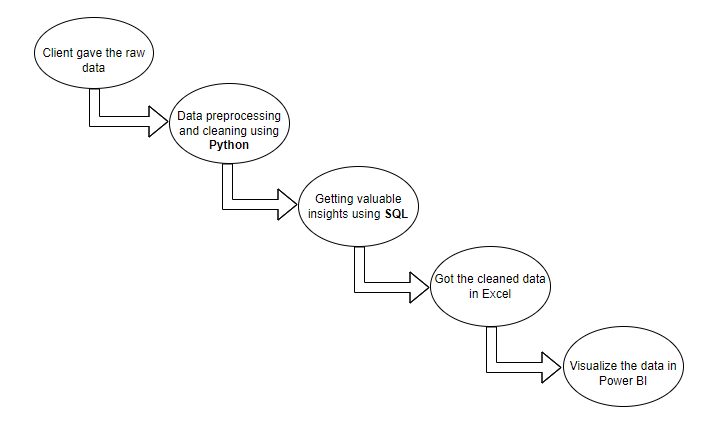

## Playstore Apps Analysis & Visualization

It's a Real time Data Analytics project for an organization based in San Fransisco. The goal of this project is to find valuable insights
from the Google Play store Apps consisting of variety of fields like **apps**, **category**, **rating**, **installs**, **sentiment**, etc..

The project consist of two datasets:
1. **apps**
2. **reviews**

#### Tools used in this project:
1. **Python** - Data preprocessing and cleaning using numpy and pandas
2. **SQL** - Getting insights from the data through sql queries
3. **Excel** - Data Acquisition (got the cleaned datasets)
4. **Power BI** - Data Visualization by making dashboard

### Interactive Dashboard - https://www.novypro.com/project/play-store-1
#### Project FLow

